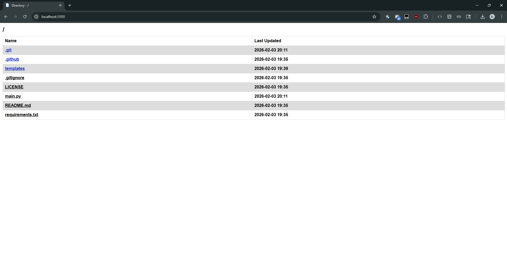

# webfilepy
This is basically just a recreation of the file browser from Apache, main difference being that you can fetch raw data with the `raw` param and that it's not ugly like regular Apache. It doesn't have that many customizations because it was explicitly made for how I liked it.

## Preview
> 
> File View

> 
> Directory View

## Installation & Usage
> Note: Does not always work properly on Windows, especically if not sharing root directories (like `C:`)

Probably the easiest file browser to ever get ran. Open a terminal and do the following:
```
git clone https://github.com/sirkingbinx/webfilepy
cd webfilepy
pip install -r requirements.txt

python main.py <your directory you want to share> <port (optional, defaults to 5000)>
```
Move yourself to your local browser and type in `localhost:<port>`. There's your directory, previewable by anyone.
